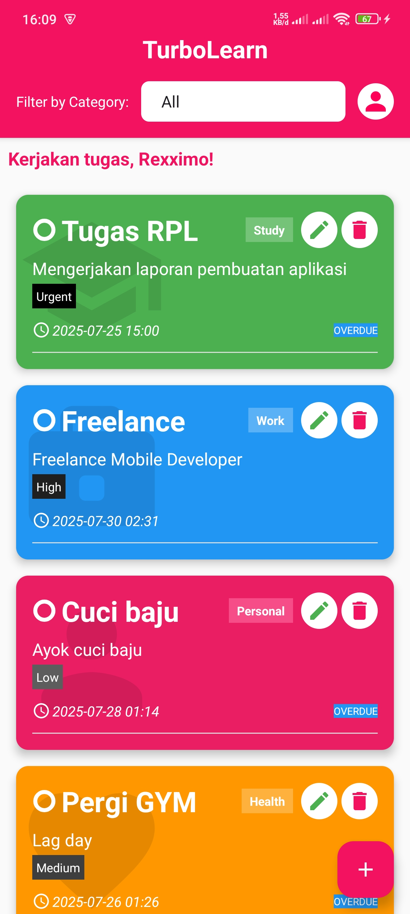
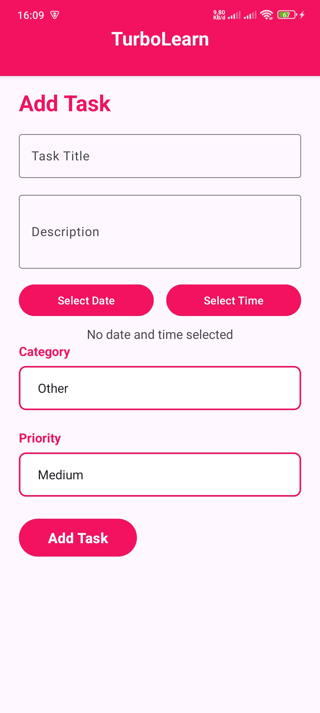
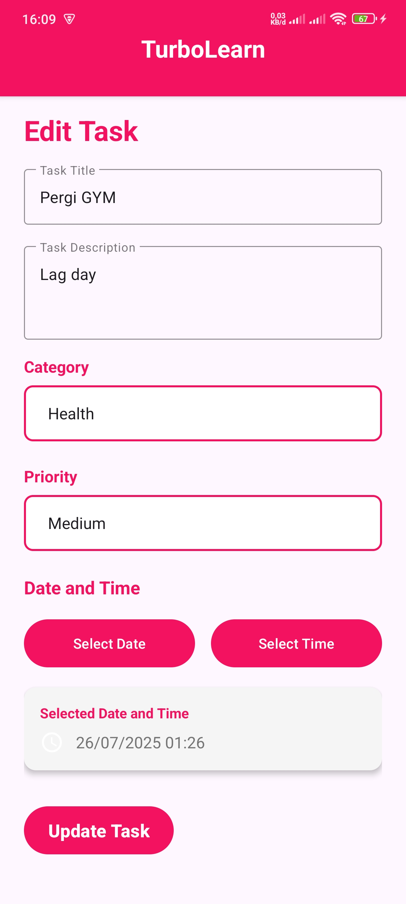

# Dependencies yang ditambahkan:
```javascript
dependencies {

    implementation ("com.google.android.material:material:1.8.0")
    implementation ("androidx.recyclerview:recyclerview:1.3.0")
    implementation ("androidx.cardview:cardview:1.0.0")


    implementation ("com.google.firebase:firebase-firestore:25.1.4")
    implementation ("com.google.firebase:firebase-database:21.0.0")
    implementation ("com.google.firebase:firebase-auth:23.2.1")
    implementation(platform("com.google.firebase:firebase-bom:33.16.0"))

    implementation("com.airbnb.android:lottie:6.3.0")
    implementation ("com.github.GrenderG:Toasty:1.5.0")


    implementation ("com.wdullaer:materialdatetimepicker:4.2.3")
    implementation ("androidx.work:work-runtime:2.7.1")

    testImplementation ("junit:junit:4.13.2")
    androidTestImplementation ("androidx.test.ext:junit:1.1.3")
    androidTestImplementation ("androidx.test.espresso:espresso-core:3.4.0")

    implementation ("com.google.guava:guava:32.1.3-android") 
    implementation ("androidx.work:work-runtime-ktx:2.9.0")

}

```
# Permission yang dipakai:
```javascript
    <uses-permission android:name="android.permission.INTERNET" />
    <uses-permission android:name="android.permission.ACCESS_NETWORK_STATE" />
    <uses-permission android:name="android.permission.POST_NOTIFICATIONS" />
    <uses-permission android:name="android.permission.VIBRATE" />
    <uses-permission android:name="android.permission.RECEIVE_BOOT_COMPLETED" />
    <uses-permission android:name="android.permission.WAKE_LOCK" />

```
# Tampilan dan fitur aplikasi

1. Splash Screen<br>
Splash Screen menggunakan animasi dari lottie<br>
<br><br>

2. Register<br>
User melakukan registrasi dengan menginputkan nama, email, dan password.<br>
Password memiliki ketentuan minimal 8 karakter dan maksimal 15 karakter dengan huruf besar dan angka minimal 1 karakter.<br>
<br><br>

3. Login<br>
User harus menginpukan email dan password valid yang sudah didaftarkan sebelumnya<br>
<br><br>

4. Home<br>
User bisa melihat tugas yang telah mereka buat dan mereka juga bisa menghapunya disini.<br>
Tugas disini memiliki kategori tertentu dan dipadukan dengan warna yang berbeda<br>
contohnya untuk kategori Study diwarnai dengan warna hijau.<br>
<br><br>

5. Home (menampilkan tugas berdasarkan kategori tertentu)<br>
User bisa melihat tugas berdasarkan kategori tertentu<br>
<br><br>

6. Add Task<br>
User menginputkan judul, deskripsi, tanggal dan jam untuk pengingat tugas yang dapat memunculkan alarm setelah tanggal dan jam tertentu,<br>
menginputkan kategori tugas yang terdiri dari kategori personal, work, study health dan other, dan prioritas tugas yang terdiri dari low, medium, hight, dan urgent.<br>
<br><br>

7. Edit Task<br>
User bisa mengedit atau mengubah tugas yang telah dibuat sebelumnya<br>
<br><br>

8. Tandai Tugas Yang Selesai<br>
User bisa menandai tugas yang telah diselesaikan dan tugas yang telah selesai akan muncul di halaman profile<br>
<br><br>

9. Profile<br>
User bisa melihat jumlah tugas yang telah dia kerjakan berdasarkan kategori<br>
<br><br>


